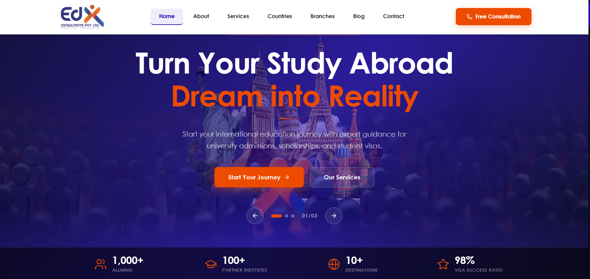

# EDX Consultants — Corporate Website

Official corporate website for **EDX Consultants Pvt. Ltd.** — Pakistan's 
trusted study abroad consultancy. Built with **Next.js** and deployed on 
**Vercel**, serving 1,000+ students with guidance for international 
university admissions, scholarships, and visa assistance.

## 🌐 Live

[edxconsultants.com](https://edxconsultants.com/)

## 🎯 Key Highlights

- 🌍 **Interactive globe** — 3D destination explorer showing 13 countries 
  and 100+ partner universities
- ⭐ **Google Reviews integration** — live 4.9★ rating from 55+ verified reviews
- 📱 **Fully responsive** — mobile, tablet, desktop optimized
- ⚡ **Next.js App Router** — fast, SEO-optimized pages
- 🎓 **Success stories gallery** — student achievement showcase
- 📋 **Application form** — destination selection and consultation booking

## 📸 Screenshots

### 🏠 Homepage

### 🛎️ Services Page

## 📄 Pages

| Page | Description |
|---|---|
| **Home** | Hero slider, stats, about section, services overview, globe explorer, testimonials, success stories |
| **About** | Company story, team, 10+ years experience |
| **Services** | 9 services — Initial Consultation, Career Counseling, University Selection, Course Selection, Scholarship Guidance, Admission Application, Visa Assistance, Pre-Departure Briefing, Accommodation Support |
| **Countries** | 13 destinations — UK, USA, Canada, Australia, Malaysia, Germany, France, Netherlands, New Zealand, Ireland, Turkey, UAE, Northern Cyprus |
| **Branches** | Office locations across Pakistan |
| **Blog** | Study abroad tips and news |
| **Contact** | Free consultation booking form |

## ✨ Features

### Corporate Website
- Hero section with image slider
- Stats counter — 1,000+ Alumni, 100+ Partner Institutes, 10+ Destinations, 98% Visa Success
- Interactive 3D globe with country markers and university listings
- Service cards with individual detail pages
- Country/destination pages with partner university listings
- Google Reviews integration — live 4.9★ rating display
- Student success stories gallery
- Newsletter subscription
- Free consultation application form with destination selector
- Social media integration — Instagram, Facebook, YouTube, LinkedIn, Pinterest

### SEO & Performance
- Next.js App Router for fast page loads
- Meta tags and structured data for search optimization
- Image optimization via Next.js Image component
- Responsive design across all devices

## 🛠 Tech Stack

| Layer | Technology |
|---|---|
| Framework | Next.js 14 (App Router) |
| Language | JavaScript / TypeScript |
| Styling | CSS Modules / Tailwind CSS |
| Deployment | Vercel |
| Performance | Next.js Image Optimization |

## 📊 Impact

- **1,000+** students guided to international universities
- **100+** partner institutes across 13 countries
- **98%** visa success rate
- **10+** years of consultancy experience
- **4.9★** Google rating from 55+ verified reviews

## Developer

**Humza Yousaf** — Full-Stack Developer  
[LinkedIn](https://www.linkedin.com/in/humza-yousaf-a81440141) • [GitHub](https://github.com/Humza570)
